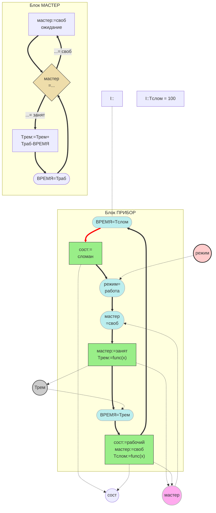

# Операторно-параметрическая схема модели ремонта «Прибор-Мастер»

**Markdown с Mermaid**

## Описание схемы

- **Блок ПРИБОР**: моделирует цикл поломки и ремонта прибора. Прибор ломается (Tслом), переходит в состояние «сломан», ждёт свободного мастера, после ремонта возвращается в рабочее состояние.
- **Блок МАСТЕР**: моделирует занятость мастера. Ромб проверяет состояние «мастер занят/свободен»; при занятости выполняется ремонт (Tрем), при свободе — ожидание.
- **Параметры**: сост (состояние), режим, мастер, Трем — связывают оба блока в единую ОПС.
